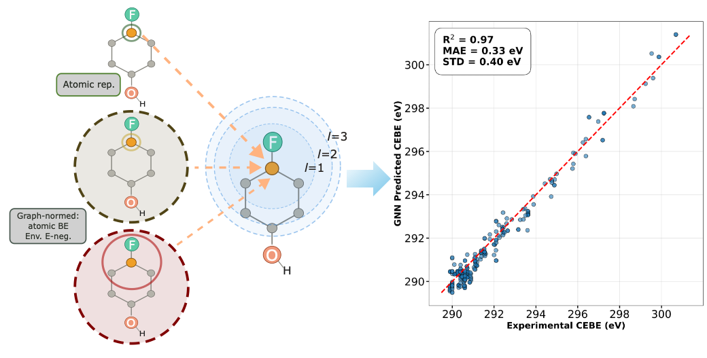

# AugerNet

*Machine learning for Auger-electron spectroscopy (AES) and x-ray photoelectron spectroscopy (XPS)*

v2.0.0.0 of AugerNet now includes fully operational:
1) Equivariant GNN predictions of: 
  - a: core-electron binding energies (CEBE) 
  - b: Auger-Electron spectra (AES) 

2) CNN classifications of local bond environments (functional groups) from AES spectra with CEBEs included with:
  - a: Simple augmentation to input spectra
  - b: Conditioned with feature-wise linear modulation (FiLM) layers



AugerNet currently provides **three model types**:

| Model        | Config name  | Task                                               |
|--------------|--------------|-----------------------------------------------------|
| **CEBE GNN** | `cebe-gnn`   | C 1s CEBE prediction from molecular graphs |
| **Auger GNN**| `auger-gnn`  | Auger spectrum prediction (stick or fitted) from molecular graphs |
| **Auger CNN**| `auger-cnn`  | Carbon-environment classification from broadened Auger spectra |

Doc site template undergoing updates can be found at https://afouda11.github.io/AugerNet/
## Installation

Requires Python >= 3.10 and [conda](https://docs.conda.io/en/latest/miniconda.html).

```bash
# Clone the repository
git clone https://github.com/afouda11/AugerNet.git
cd AugerNet

# Create the conda environment (installs all dependencies + the package)
conda env create -f environment.yml
conda activate augernet
```

The `environment.yml` installs all required dependencies (PyTorch, PyTorch Geometric,
RDKit, scikit-learn, SkipAtom, etc.) and the `augernet` package itself in editable mode.

> **Note:** The provided `environment.yml` targets macOS (Apple Silicon / MPS).
> For Linux with CUDA, replace the PyTorch pip lines with the appropriate versions
> from the [PyTorch install guide](https://pytorch.org/get-started/locally/) and
> the [PyG install guide](https://pytorch-geometric.readthedocs.io/en/latest/install/installation.html).

### uv alternative

`uv` is a fast Python package manager; see their documentation [here](https://docs.astral.sh/uv/).

```bash
# Install uv - https://docs.astral.sh/uv/getting-started/installation/
curl -LsSf https://astral.sh/uv/install.sh | sh

# Install AugerNet Python package dependencies
uv sync
```

> You can use `uv` to run the Python commands by prefixing them with `uv run`.
> `uv run` executes commands in an isolated virtual environment with all required
> dependencies. See the [documentation](https://docs.astral.sh/uv/reference/cli/#uv-run).

## Quick Start

All runs are controlled by a single YAML config file.
Example configs are provided in `examples/`.

```bash
# Download processed graph data from https://zenodo.org/records/22283453
python scripts/prepare_data.py --from-zenodo
# CEBE GNN — train: Will recreate same model in artifact and the main result in:
# arXiv:2604.27070
python -m augernet --config examples/gnn_cebe_configs/train.yml

# Auger GNN: 
# Single-task train:
python -m augernet --config examples/gnn_auger_configs/train_auger_single_task.yml
# Multi-task train:
python -m augernet --config examples/gnn_auger_configs/train_auger_cebe_multi_task.yml

# Auger+CEBE CNN:
# CV run for E_b FiLM and 'chemical' merging scheme used in submitted manuscript (slow calc):
# Slow clac but the cv_* files give cnn_auger_configs main paper results in Table 2
python -m augernet --config examples/cnn_auger_configs/cv_film_chemical.yml
# TRAIN run for No E_b or merging scheme, quick example check:
python -m augernet --config examples/cnn_auger_configs/train.yml
# PARAM search run one the FWHM broadening used for Figure 6 in the paper: 
# No merging and E_b inlcuded with augmentation to input
python -m augernet --config examples/cnn_auger_configs/fwhm_aug.yml

```

## Model Types

See .yml files in `examples` for the details on how each model and mode is run.\
Full doc site will be released soon. 

Output is written to `{model_type}_{mode}_results/` (e.g.
`cebe_gnn_train_results/`, `auger_cnn_train_results/`) \
with subdirectories `models/`, `outputs/`, and `pngs/`.

### CEBE GNN (`cebe-gnn`)

Predicts per-atom carbon 1s core-electron binding energies using an equivariant or invariant message-passing neural network.\
Input is a set of `.xyz` molecular geometries converted to PyG graphs with configurable node features.

### Auger GNN (`auger-gnn`)

Uses same GNN architecture as cebe-gnn to predicts Auger-electron spectra from molecular graphs.\
Can be run in single task (just AES) or multi-task (AES + CEBE) prediction modes.

### Auger CNN (`auger-cnn`)

Classifies carbon environments from broadened Auger spectra using a 1D CNN.\
The CEBE can be inlcuded with either augmentation to the AES lineshape or, with feature-wise linear modulation layers.

## Run Modes

AugerNet supports five run modes, set via `mode:` in the yml config.\
All three model types share the same mode system.

### train — Train a single model

Train one model on a single k-fold split with optional evaluation.

For `run_evaluation: true`
113 mols in expirmental cebe data split into: 
  - Validation set (`val`) (to assist fold and param search)
  - Final evaluation set (`eval`)

### cv — K-fold cross-validation

Train one model per fold, evaluate each, and write a JSON summary.

### param — Hyperparameter search

Train one fold per configuration from a Cartesian-product grid.

A unique `search_id` is derived from the searched dimensions so that\
different grid searches don't overwrite each other.

Path to processed evaluation data set interally in AugerNet \
`exp_split: 'both'` will have `eval` and `val` prefixes assigned to different outputs

### evaluate — Evaluate a saved model

Load a previously trained `.pth` model and evaluate it on experimental data.\
Architecture fields must match the values used during training.

### predict — Predict on new molecules

Run inference on a directory of `.xyz` files using a saved GNN model.\
No pre-processing is needed — molecular graphs are built on the fly.

> **Note:** The GNN models are trained on carbon 1s properties. Predictions
> for non-carbon atoms are not meaningful and are marked with `*` in the
> output labels file.


## Configuration Reference

See [docs/configuration.md](docs/configuration.md) for the full reference,
or the light summary below, however a more detailed documentation will be made soon.

### Identity

| Field   | Default    | Description                                         |
|---------|------------|-----------------------------------------------------|
| `model` | `cebe-gnn` | Model type: `cebe-gnn` / `auger-gnn` / `auger-cnn` |
| `mode`  | `train`    | Run mode: `cv` / `train` / `param` / `evaluate` / `predict` |

### Node Features (GNN models)

| Key | Name           | Dim | Description                             |
|-----|----------------|-----|-----------------------------------------|
| 0   | `skipatom_200` | 200 | SkipAtom atom-type embedding            |
| 1   | `skipatom_30`  | 30  | SkipAtom atom-type embedding (compact)  |
| 2   | `onehot`       | 5   | Element one-hot (H, C, N, O, F)         |
| 3   | `atomic_be`    | 1   | Isolated-atom 1s binding energy         |
| 4   | `mol_be`       | 1   | Molecular CEBE for C, atomic for others |
| 5   | `e_score`      | 1   | Electronegativity-difference score      |
| 6   | `env_onehot`   | 36  | Carbon-environment one-hot              |

### GNN Architecture

| Field             | Default | Description                            |
|-------------------|---------|----------------------------------------|
| `layer_type`      | `EQ`    | `EQ` (equivariant) or `IN` (invariant) |
| `hidden_channels` | `64`    | Hidden channel width                   |
| `n_layers`        | `3`     | Number of message-passing layers       |

### Auger GNN — Spectrum

Details for this model will be released in a future release.

### Auger CNN — Specific

Details for this model will be released in a future release.

## Output File Naming

### Output directory naming

Each model type writes to its own results directory:

| Model      | Directory pattern                |
|------------|----------------------------------|
| `cebe-gnn` | `cebe_gnn_{mode}_results/`       |
| `auger-gnn`| `auger_gnn_{mode}_results/`      |
| `auger-cnn`| `auger_cnn_{mode}_results/`      |

Each contains `outputs/` and `pngs/` subdirectories. Train, cv, and param
modes also create a `models/` subdirectory.

### GNN output files (per fold)

| File                                | Description                             |
|-------------------------------------|-----------------------------------------|
| `{model_id}_fold{fold}.pth`         | Saved model weights                     |
| `{model_id}_fold{fold}_loss.png`    | Training/validation loss curves         |
| `{model_id}_fold{fold}_scatter.png` | Predicted vs experimental scatter plot  |
| `{model_id}_fold{fold}_results.txt` | Numeric predicted vs true (carbon only) |
| `{model_id}_cv_summary.json`        | Cross-validation summary (cv mode)      |

### CNN output files (per fold)

Details for this model will be released in a future release.

## Data Preparation
Processed and raw data files are stored at https://zenodo.org/records/22283453\ 

To download pre-processed data to `data/processed/` run: 
```bash
python scripts/prepare_data.py --from-zenodo
```

To dowloand both the pre-processed data to `data/processed/` and\
raw data to `data/raw/` and unpack run:
```bash
python scripts/prepare_data.py --from-zenodo --with-raw
```

To dowloand both the raw data to `data/raw/`, unpack then process graphs locally run: 
```bash
python scripts/prepare_data.py --with-raw
```

To just process graphs locally from pre-downloaded raw run:
```bash
python scripts/prepare_data.py
```

This repository contains a compressed dir of the skipatom: https://github.com/lantunes/skipatom\
files required to use the skipatom-200 and skipatom-30 vectors as atom type rep node features in:
`data/raw/skipatom.tar.gz`\
`prepare_data.py` will unpack this if it has not already been unpacked.

## Tests

Tests are split into two tiers using pytest markers:

| Tier | Marker | Count | Description |
|------|--------|-------|-------------|
| **Essential** | `@pytest.mark.essential` | ~40 | Fast tests (config, features, parsing)|
| **Full** | `@pytest.mark.full` | ~40 | Slower tests (real molecule graphs, model symmetry) |

Currently only `test_cebe_gnn_config.py` is ran in the CI workflow to reduce run-time

### Running tests

```bash
# Essential tests only 
uv run pytest tests/ -m essential -v --tb=short

# Full suite (all tests)
uv run pytest tests/ -v --tb=short

# Single file
uv run pytest tests/test_cebe_gnn_model.py -v
```

### Test files

| File | What it tests |
|------|---------------|
| `test_cebe_gnn_config.py` | Dataclass defaults, `resolve()` derived fields, YAML loading and validation |
| `test_cebe_gnn_features.py` | Feature key parsing, z-score scaling, node feature assembly, dataset assembly |
| `test_cebe_gnn_graph.py` | XYZ-to-graph pipeline, bond detection, edge attributes, electronegativity scores, carbon environments |
| `test_cebe_gnn_model.py` | MPNN forward pass shapes, translation/rotation invariance, permutation equivariance for both EQ and IN layers |

Graph and model tests use a real molecule (`dsgdb9nsd_133427`) from `tests/test_mol/`
rather than synthetic data. Model symmetry tests verify that CEBE predictions
are invariant to rotation and translation and equivariant to atom reordering
properties required by the physics of the problem.


## Artifact Generation

The artifact showcases the main result of the release (in plots) and includes the\ config file and model weights that produced it.
`scripts/export_best_model.py` is used to copy the selected model to the artifact.\
For a `cv` or `param` run identify the best fold and copy its weights, plots, and\ config into the tracked `artifacts/` directory for release.\
Here the train run for the main rersult in the CEBE GNN manuscript is used for the artifact.

```bash
uv run python scripts/export_best_model.py
uv run python scripts/export_best_model.py --results-dir auger_gnn_param_results
uv run python scripts/export_best_model.py --overwrite
```

`artifacts/data_manifest.yml` records the Zenodo DOI and SHA-256 checksums
for all data files. To verify integrity:

```bash
 md5sum -a 256 data/processed/*.pt data/raw/*.tar.gz
```
